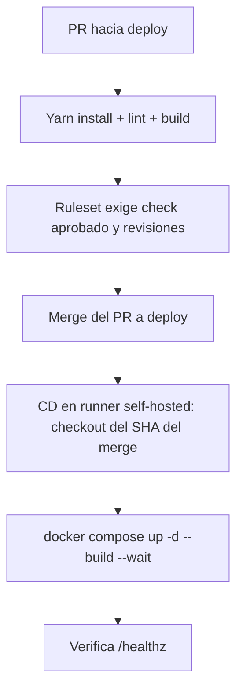

# CI y CD del frontend

## CI

El workflow `.github/workflows/ci.yml` corre solo en pull requests dirigidos a `development`, `deploy` o `main` (apertura, nuevos commits y reapertura). No corre en pushes, tampoco tras el merge, ni de forma manual. Usa Node.js 22 y Yarn 1.22.22, conforme al proyecto.

El check **Frontend lint and build** instala el lockfile con `yarn install --frozen-lockfile --non-interactive`, ejecuta ESLint sin permitir warnings y construye el frontend con `VITE_API_URL=/api`.

El proyecto actual usa JavaScript/JSX. ESLint verifica reglas de JavaScript y React, pero no realiza chequeo de tipos TypeScript; Vite tampoco. Para agregar ese requisito hay que incorporar TypeScript y una configuracion de tipos, o checkJs/JSDoc, corregir sus diagnosticos y ejecutar un comando typecheck antes del build. No se ha migrado el codigo en este cambio.

Esta primera version no ejecuta tests de navegador ni construye o arranca Nginx/Docker. No requiere backend ni secretos productivos. Un build exitoso no garantiza que los endpoints respondan en produccion.

### Prueba local

Desde la raiz del frontend, con Node.js 22 y Yarn 1.22.22:

```bash
yarn install --frozen-lockfile --non-interactive
yarn lint --max-warnings 0
VITE_API_URL=/api yarn build
```

Estos comandos comprueban los pasos locales, no los triggers o permisos de GitHub. Para ejecutar el workflow completo ver [Probar los workflows con act](#probar-los-workflows-con-act).

## CD

`.github/workflows/cd.yml` se activa con `pull_request` de tipo `closed` hacia `deploy`, y el job solo corre si `github.event.pull_request.merged == true`. Un PR cerrado sin merge se omite. Un push directo a `deploy` no dispara CD, y no hay ejecucion manual.

Despliega el commit del merge (`pull_request.merge_commit_sha`, no `github.sha`, que en eventos `pull_request` no es el commit que quedo en `deploy`) directamente en la VM.

### Donde corre

En el runner self-hosted `scorpio-frontend-01` (`runs-on: [self-hosted, scorpio-frontend]`), instalado en `/opt/gh-runner/runner-scorpio-frontend` como servicio systemd. Corre con el usuario `gh-runner`, de los grupos `docker` y `scorpio-local`, y opera sobre `/opt/SCORPIO/scorpio-frontend`, el mismo directorio con el `.env` de produccion.

- El repositorio debe ser escribible por el grupo `scorpio-local` (`chmod -R g+w`) y tener `core.sharedRepository=group`. Los pasos usan `umask 002`.
- `gh-runner` no es dueno del directorio; el job declara `safe.directory` con variables `GIT_CONFIG_*`.
- **No desarrollar en ese directorio.** Tras desplegar queda en *detached HEAD*. Si hay cambios sin commitear en archivos versionados, CD falla en vez de sobrescribirlos. `.env`, `dist/` y `node_modules/` estan ignorados y no bloquean.

### Pasos

| Paso | Que hace |
| --- | --- |
| Check deploy directory is clean | Falla si hay cambios sin commitear en archivos versionados |
| Check backend network exists | Exige que exista `scorpio-net`, que crea el stack del backend. Desplegar el backend primero |
| Fetch merged commit | `git fetch origin deploy` con el `GITHUB_TOKEN` del job y comprueba que el SHA pertenezca a `origin/deploy` |
| Check out merged commit | `git checkout --detach <merge_commit_sha>` |
| Build and start container | `docker compose up -d --build --remove-orphans --wait --wait-timeout 180`. `VITE_API_URL` se lee del `.env` y se incorpora al bundle al compilar |
| Verify health | `wget --spider http://127.0.0.1/healthz` dentro del contenedor (el host de la VM no alcanza los puertos publicados por Docker) |
| Print diagnostics on failure | `docker compose ps -a` y los ultimos 200 logs |
| Record deployment | Estado, PR, SHA esperado y SHA desplegado en el resumen de Actions |

El healthcheck usa `127.0.0.1` y no `localhost`: en la imagen Alpine `localhost` resuelve a `::1` y nginx solo escucha en IPv4, por lo que el contenedor quedaba `unhealthy` y `--wait` fallaria.

### Fallos y recuperacion

Si falla antes de `docker compose up`, la VM sigue con la version anterior. Para volver atras, mergear en `deploy` un PR que revierta el cambio, o manualmente en la VM: `git checkout --detach <sha-anterior> && docker compose up -d --build --wait`.

## Regla de merge

En GitHub, activar un ruleset para `deploy` (y `development` si se quiere el mismo control) con PR obligatorio y **Require status checks to pass**, seleccionando **Frontend lint and build**. Exigir la rama actualizada y configurar revisiones y bypass segun el equipo. El YAML no crea esta regla ni hace que CD espere a CI. Un push directo no dispara CD pero si cambia `deploy`, por eso el ruleset debe bloquearlo.



## Probar los workflows con act

[act](https://github.com/nektos/act) ejecuta los workflows en contenedores Docker locales a partir de un evento simulado, sin abrir un PR ni tocar GitHub. Requiere Docker.

Instalacion sin sudo:

```bash
curl -sSfL https://raw.githubusercontent.com/nektos/act/master/install.sh | bash -s -- -b ~/.local/bin
```

Los eventos simulados estan en [.github/act-events](../.github/act-events):

| Archivo | Simula |
| --- | --- |
| `pr-merged-deploy.json` | PR #123 mergeado a `deploy` (`merge_commit_sha: deadbeef`) |
| `pr-closed-deploy.json` | PR hacia `deploy` cerrado sin merge |
| `pr-opened-development.json` | PR abierto hacia `development` |

Desde la raiz del repositorio:

> **No ejecutar CD con act sin `-n`.** CD despliega en produccion sobre `/opt/SCORPIO/scorpio-frontend` y el Docker del host. Usar solo dry-run, que lista los pasos sin ejecutarlos. Como proteccion, el primer paso (`Refuse to run under act`) falla si detecta la variable `ACT` y el job se detiene antes de tocar git o Docker.

```bash
# CD, PR mergeado (dry-run): lista los pasos de "Deploy to VM"
act pull_request -n -W .github/workflows/cd.yml -e .github/act-events/pr-merged-deploy.json \
  -P self-hosted=catthehacker/ubuntu:act-latest

# CD, PR cerrado sin merge (dry-run): no planifica ningun paso
act pull_request -n -W .github/workflows/cd.yml -e .github/act-events/pr-closed-deploy.json \
  -P self-hosted=catthehacker/ubuntu:act-latest

# CI completo: checkout, Node, Yarn, lint y build
act pull_request -W .github/workflows/ci.yml -e .github/act-events/pr-opened-development.json \
  -P ubuntu-latest=catthehacker/ubuntu:act-latest
```

- CI necesita `catthehacker/ubuntu:act-latest` (1-2 GB la primera vez).
- Agregar `-l` para listar los jobs o `-n` para un dry-run.

Limitaciones:

- **act ignora los filtros `branches:` de `pull_request`**: CI y CD corren aunque el PR simulado apunte a otra rama. Esos filtros solo se comprueban en GitHub. La condicion `merged == true` de CD si se evalua.
- No valida rulesets, checks requeridos, permisos del `GITHUB_TOKEN` ni comportamiento propio de los runners de GitHub. La comprobacion definitiva sigue siendo un PR real.

## Pendiente

- Si se requiere aprobacion antes de modificar produccion, configurar un environment `production` con revisores y asociarlo al job.
- CD no consulta el resultado de CI; depende del ruleset de `deploy`.
- Revisar con el administrador por que el host de la VM no alcanza los puertos publicados por Docker (`curl: (56) Connection reset by peer`).
